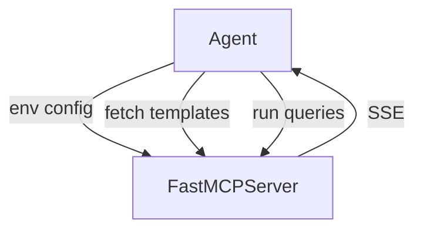
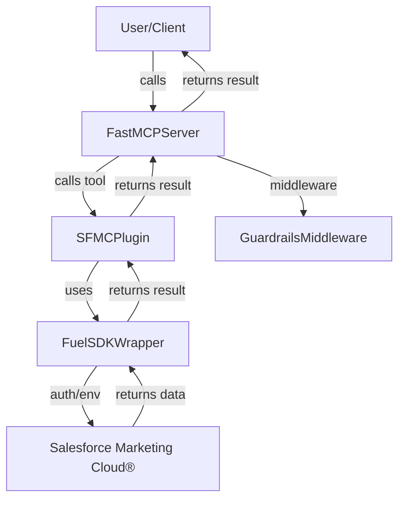
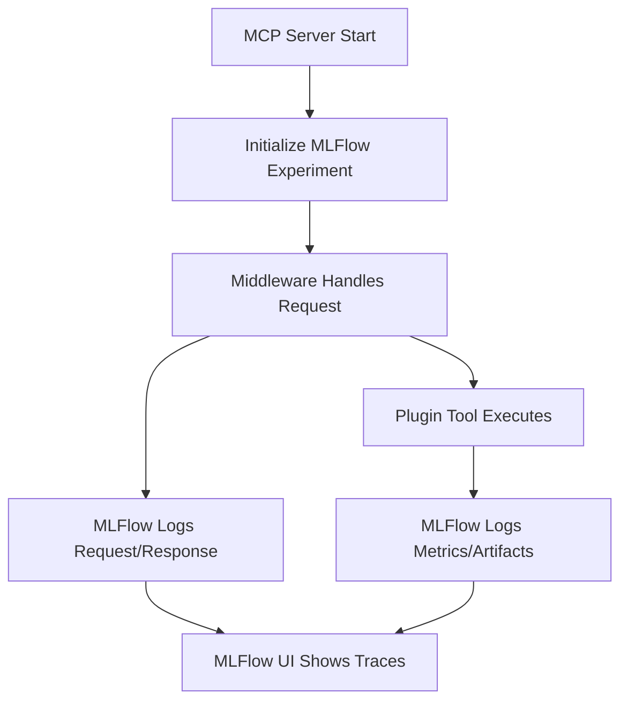

# PII Redacting FastMCP Server with Salesforce Marketing Cloud® (SFMC) Integration

## Overview
## What is an Agent?

An **agent** in this context is an autonomous client application that connects to the FastMCP server, discovers available tools, and can invoke those tools programmatically. Agents can be used to automate workflows, integrate with LLMs, or serve as bridges between FastMCP and other systems. They handle connectivity, error handling, logging, and can be extended with tracing or monitoring. The provided `agent.py` is a reference implementation that demonstrates how to connect, list, and invoke FastMCP tools, including robust error handling and MLflow tracing.

### Agent Design and Workflow

The agent connects to the FastMCP server, discovers available tools, and invokes them as needed. Below is a Mermaid diagram illustrating the agent's interaction with the FastMCP ecosystem:



### How to Run the Agent

1. **Start the FastMCP server**  
   Ensure the FastMCP server is running and accessible at the URL specified in your `.env` file (default: `http://localhost:8000/mcp`).

2. **Install dependencies**  
   ```
   pip install -r requirements.txt
   ```

3. **Set environment variables**  
   Copy `.env.example` to `.env` and update as needed.

4. **Run the agent**  
   ```
   python agent.py
   ```

The agent will connect to the server, list available tools, and attempt to invoke each tool, logging results and errors.

## What does this MCP do?
This project is a FastMCP server that provides secure, privacy-first orchestration for Salesforce Marketing Cloud® (SFMC) using the [FuelSDKWrapper](https://github.com/SnapLyte/FuelSDK-Python-Wrapper). All incoming and outgoing data is protected by a Guardrails Middleware that uses Presidio to automatically redact sensitive PII (personally identifiable information).

**Key Features:**
- **PII Redaction:** All requests and responses are filtered through Presidio-based middleware for automatic PII redaction.
- **Salesforce Marketing Cloud® Integration:** Read-only access to Salesforce Marketing Cloud® email templates and queries, with extensible support for other operations.
- **FastMCP Tools:** Exposes Salesforce Marketing Cloud® operations as FastMCP tools for easy integration with LLMs, agents, or other orchestrators.
- **Environment-based Credentials:** Salesforce Marketing Cloud® credentials are loaded from environment variables for security.
- **Structured Error Handling:** All errors are logged and returned as structured responses.
- **Extensible:** Easily add more Salesforce Marketing Cloud® operations (send email, manage contacts, etc.) as needed.

---

## Architecture



### Architecture Description

The architecture is designed for secure, modular, and privacy-preserving orchestration:

- **User/Client:** Initiates requests to the FastMCP server, which can be an LLM, agent, or any client application.
- **FastMCPServer:** Acts as the central orchestrator, exposing tools and plugins via a JSON-RPC API. All traffic passes through the Guardrails Middleware.
- **GuardrailsMiddleware:** Uses Microsoft Presidio to automatically redact PII from all incoming requests and outgoing responses, ensuring privacy and compliance.
- **SFMCPlugin:** Implements FastMCP tools for Salesforce Marketing Cloud® operations (e.g., fetching email templates, queries). It abstracts the integration logic and error handling.
- **FuelSDKWrapper:** A modern Python wrapper for the Salesforce® FuelSDK, used by the plugin to interact with Salesforce Marketing Cloud® APIs. Credentials are injected via environment variables for secure secrets management.
- **SFMC (Salesforce Marketing Cloud®):** The external SaaS platform where marketing assets and queries are managed. All communication is authenticated and secured.
- **Data Flow:** Requests from the user are redacted for PII, routed to the appropriate Salesforce Marketing Cloud® tool, processed via FuelSDKWrapper, and responses are redacted again before returning to the user.
- **Security:** No credentials or PII are ever logged, stored, or exposed. All secrets are managed via environment variables, and the system is designed for easy integration with secret managers and cloud-native deployments.

This modular approach allows you to add new plugins, tools, or middleware layers as needed, while maintaining strict privacy and security controls throughout the stack.

## MLFlow Instrumentation & Tracing

This project uses MLFlow (pinned to version 3.1.4) for experiment tracking, tracing, and observability. It is enabled in the .env:
```
ENABLE_MLFLOW=true
MLFLOW_TRACKING_URI=http://localhost:5000
MLFLOW_EXPERIMENT=FastMCP Tracing
```

### Usage

- Middleware and plugin tool functions are instrumented to log traces, metrics, and artifacts to MLFlow.
- Each request and plugin execution is tracked as an MLFlow run.
- View traces and metrics in the MLFlow UI.

### Validation

1. Start the MCP server and trigger requests/plugins.
2. Open the MLFlow UI (`mlflow ui`) and verify that runs, metrics, and artifacts appear.
3. Check logs for successful MLFlow runs.

### Integration Diagram


---

## Features

- **Redact PII:** Uses Presidio to automatically redact emails, credit cards, SSNs, and more from all traffic.
- **Salesforce Marketing Cloud® Read-Only Tools:** 
  - Get all email templates (`sfmc_get_templates`)
  - Get all queries (`sfmc_get_queries`)
- **(Optional/Future) Salesforce Marketing Cloud® Write Tools:** 
  - Send email
  - Add contact
  - Get contact
- **Environment-based Auth:** No credentials in code or config files.
- **Unit Tested:** Includes tests for middleware, orchestrator plugin, and Salesforce Marketing Cloud® integration.

---

## Setup

1. **Install dependencies:**
   ```
   pip install -r requirements.txt
   ```

2. **Set environment variables for Salesforce Marketing Cloud®:**
   - Copy `.env.example` to `.env` and fill in your secrets.
   - Or set environment variables directly in your deployment environment.
   - **Production Note:** For production, inject environment variables from a secret manager (AWS Secrets Manager, Azure Key Vault, GCP Secret Manager, HashiCorp Vault, etc.) for best practices in secrets management.

---

## How to Test

### 1. Start the FastMCP Server

```bash
python main.py
```

### 2. Run All Unit Tests

```bash
pytest
```

- This will run all tests in the project, including:
  - **Middleware tests:** Validate PII redaction and guardrails logic (`test_middleware.py`)
  - **Orchestrator plugin tests:** Validate tool registration and orchestration logic (`test_orchestrator_plugin.py`)
  - **Salesforce Marketing Cloud® plugin tests:** Validate SFMC integration, credential handling, and security checks (`test_sfmc_plugin.py`)
- You do **not** need access to a real Salesforce Marketing Cloud® instance for these tests; all API calls are mocked.

### 3. Run Individual Test Files (Optional)

```bash
pytest test_middleware.py
pytest test_orchestrator_plugin.py
pytest test_sfmc_plugin.py
```

---

## Example Usage

### Get Email Templates

```python
from fastmcp import Client
client = Client("http://127.0.0.1:8000/mcp/")
async def main():
    async with client:
        result = await client.call_tool("sfmc_get_templates", {})
        print(result)
```

### Get Queries

```python
from fastmcp import Client
client = Client("http://127.0.0.1:8000/mcp/")
async def main():
    async with client:
        result = await client.call_tool("sfmc_get_queries", {})
        print(result)
```

---

## Testing

### Test Coverage

- **Middleware:**  
  - `test_middleware.py` covers PII redaction for incoming and outgoing messages.
    - *Test Description Example:* Validates that PII is redacted from both incoming requests and outgoing responses using Presidio.
- **Orchestrator Plugin:**  
  - `test_orchestrator_plugin.py` covers tool registration and orchestration logic.
    - *Test Description Example:* Ensures that tools are correctly registered and can be called via FastMCP.
- **Salesforce Marketing Cloud® Plugin:**  
  - `test_sfmc_plugin.py` covers SFMC integration, credential handling, and security checks.
    - `test_get_email_templates`: Ensures `get_email_templates` returns a list of templates when ET_Get and get_sfmc_client are patched; validates plugin logic and mock data.
    - `test_get_queries`: Ensures `get_queries` returns a list of queries when ET_Get and get_sfmc_client are patched; validates plugin logic and mock data.
    - `test_missing_env`: Ensures `get_sfmc_client` raises RuntimeError when required environment variables are missing; validates error handling for missing credentials.
    - `test_no_credentials_in_logs`: Ensures no credentials are present in logs when `get_sfmc_client` fails due to missing environment variables; validates secrets are not leaked in logs.

### Example Test

```python
def test_get_email_templates(monkeypatch):
    """
    Test that get_email_templates returns a list of templates when ET_Get and get_sfmc_client are patched.
    Ensures the plugin logic works and returns expected mock data.
    """
    class DummyGet:
        def get(self):
            return [{"id": "1", "name": "Welcome"}]
    monkeypatch.setattr(sfmc_plugin, "ET_Get", lambda *args, **kwargs: DummyGet())
    monkeypatch.setattr(sfmc_plugin, "get_sfmc_client", lambda: object())
    result = sfmc_plugin.get_email_templates()
    assert result["success"] is True
    assert isinstance(result["templates"], list)
```

---

## Security

- All PII is redacted by middleware before reaching any orchestration logic or being returned to clients.
- Salesforce Marketing Cloud® credentials are never stored in code or config files.
- **Production deployments should use a secret manager to inject environment variables.**

---

## Extending

- Add new Salesforce Marketing Cloud® tools by extending the `sfmc_plugin.py` module and registering them in `orchestrator_plugin.py`.
- Add new tests in `test_sfmc_plugin.py`, `test_middleware.py`, or `test_orchestrator_plugin.py`.

---

## References

- [FastMCP](https://gofastmcp.com/)
- [Presidio](https://microsoft.github.io/presidio/)
- [FuelSDKWrapper](https://github.com/SnapLyte/FuelSDK-Python-Wrapper)
- [Salesforce-FuelSDK-Sans](https://pypi.org/project/Salesforce-FuelSDK-Sans/)
